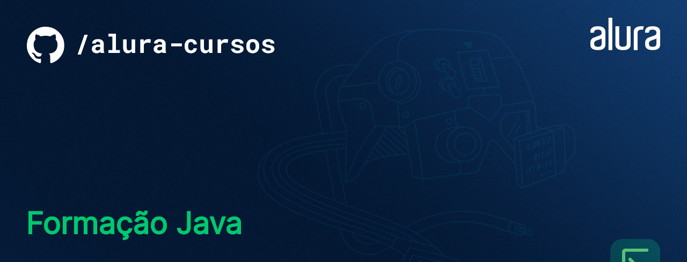

<h1 align="center"> Screenmatch</h1>

Projeto da escola Alura da formação em Java.

  <a href="#-tecnologias">Tecnologias</a>&nbsp;&nbsp;&nbsp;|&nbsp;&nbsp;&nbsp;
  <a href="#-projeto">Projeto</a>&nbsp;&nbsp;&nbsp;|&nbsp;&nbsp;&nbsp;
  <a href="#memo-licença">Licença</a>

  

 

## :🚀 Tecnologias

Esse projeto foi desenvolvido com as seguintes tecnologias:

- Java
- Git e Github

## 💻 Projeto

Projeto para desenvolver e aplicar conhecimentos na linguagem Java.
 
## :memo: Licença

Esse projeto está sob a licença MIT.